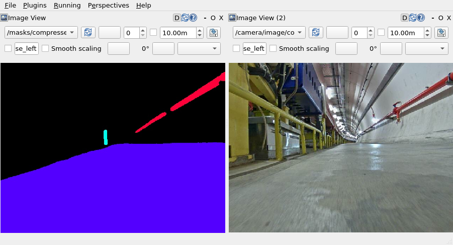

# SAM2

Docker image with SAM2 and ROS2 Humble.

## Prerequisites

* Docker
* NVIDIA Docker
* OSRF Rocker

## Docker Image
Clone this repository:
```
git clone https://github.com/RobInLabUJI/SAM2.git
```
Build the Docker image:
```
cd SAM2 && ./docker_build.sh
```
Run a Docker container:
```
cd SAM2 && ./docker_run.sh
```
Open an additional terminal in the container:
```
cd SAM2 && ./bash.sh
```

## ROS2 SAM2 Tracker
Inside the container, build the package:
```
source /opt/ros/humble/setup.bash
cd /home/user/SAM2/ros2_ws/
colcon build
```
Run the tracker node:
```
source /opt/ros/humble/setup.bash
source /home/user/SAM2/ros2_ws/install/setup.bash
ros2 run sam2_tracker sam2_tracker
```

### Example with bag file
Initial prompts (lines 71-85 of [sam2_tracker.py](https://github.com/RobInLabUJI/SAM2/blob/main/ros2_ws/src/sam2_tracker/sam2_tracker/sam2_tracker.py#L71)):
```
ann_obj_id = 1 # Red pipe
points = np.array([[595, 65], [480,150], [472,120], [425,170], [395,188]], dtype=np.float32)
labels = np.array([1,0,0,1,1], dtype=np.int32)
ann_obj_id = 2 # Floor
points = np.array([[350, 275]], dtype=np.float32)
labels = np.array([1], np.int32)
ann_obj_id = 3 # Yellow pillar
points = np.array([[298, 210]], dtype=np.float32)
labels = np.array([1], np.int32)
```
Play bag file:
```
source /opt/ros/humble/setup.bash
ros2 bag play --start-offset 25 4-2024-06-13-17-27-55_ROS2
```


## Acknowledgments

* [SAM 2: Segment Anything in Images and Videos](https://github.com/facebookresearch/sam2)
* [Segment Anything 2 + Docker](https://github.com/peasant98/SAM2-Docker)
* [Run Segment Anything Model 2 on a **live video stream**](https://github.com/Gy920/segment-anything-2-real-time)
